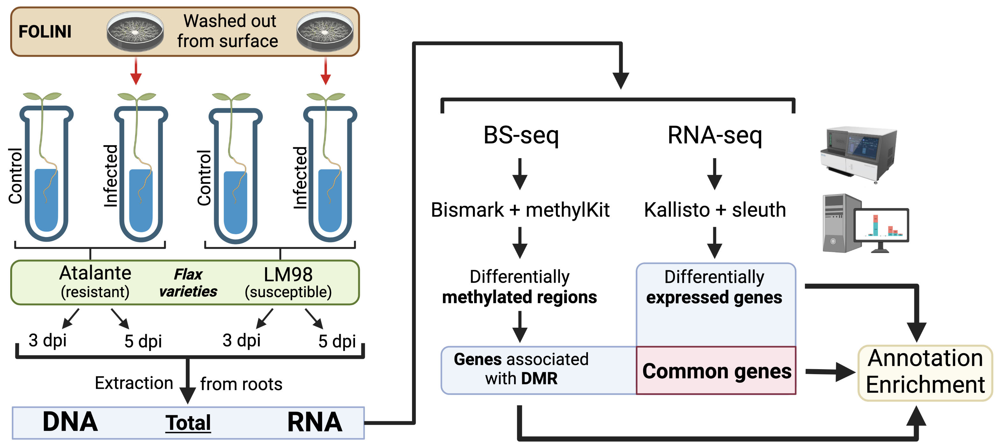
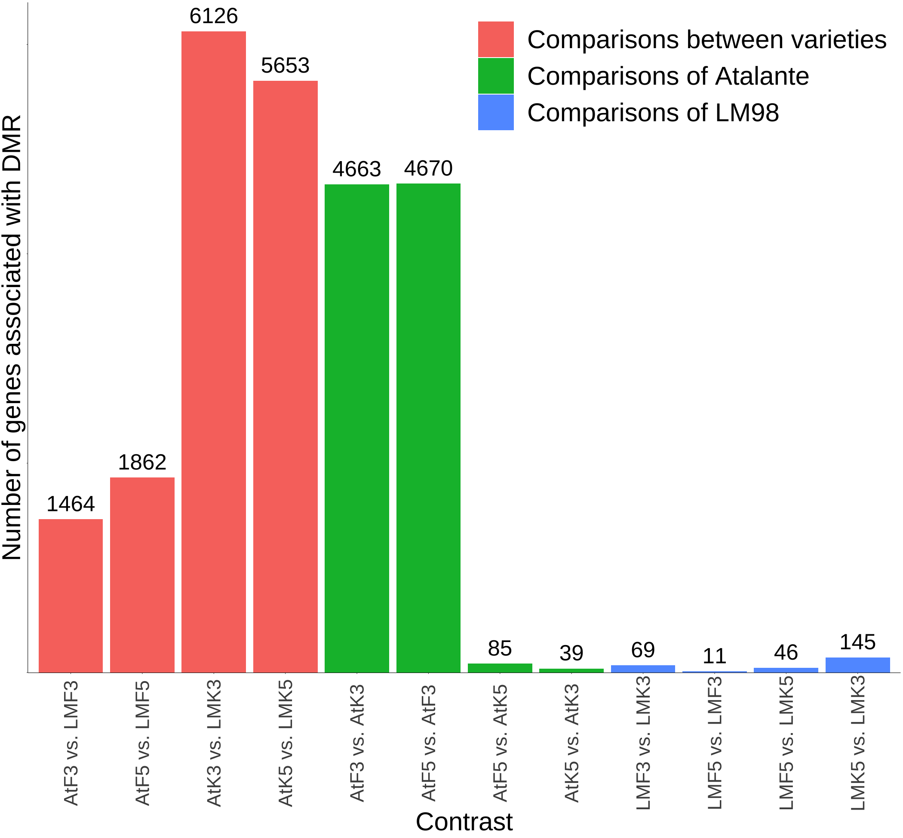
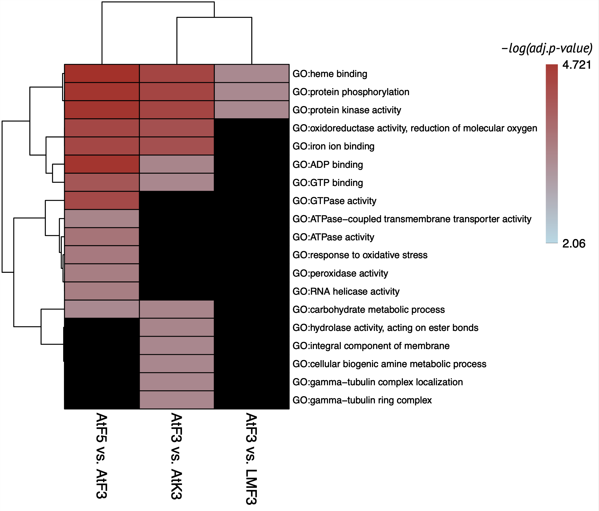
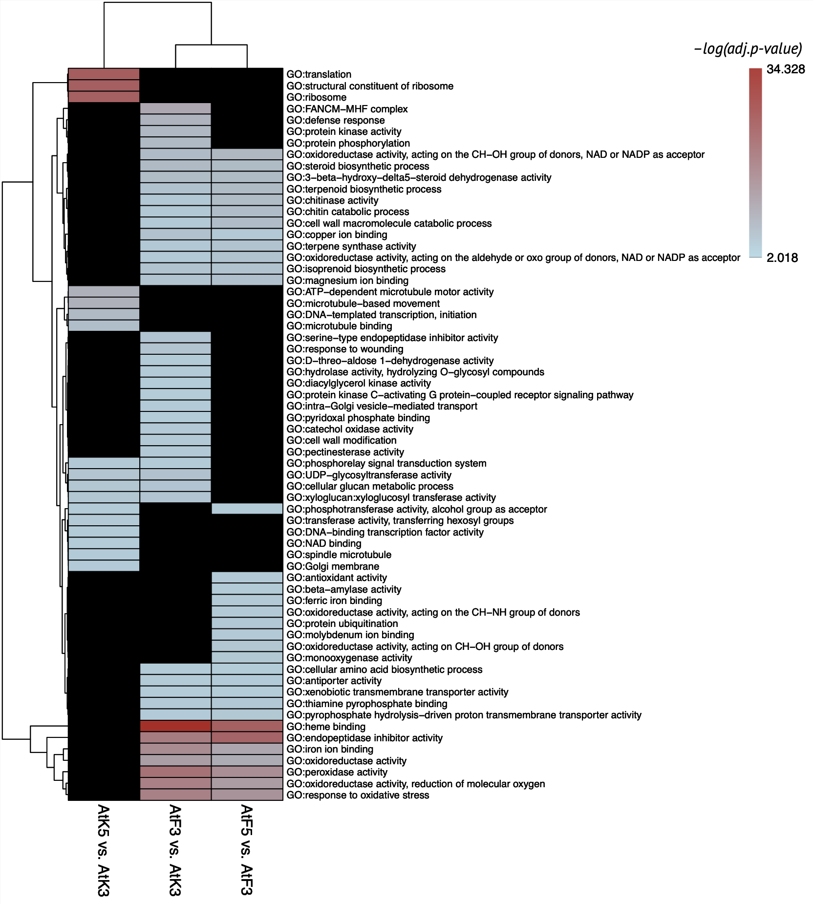
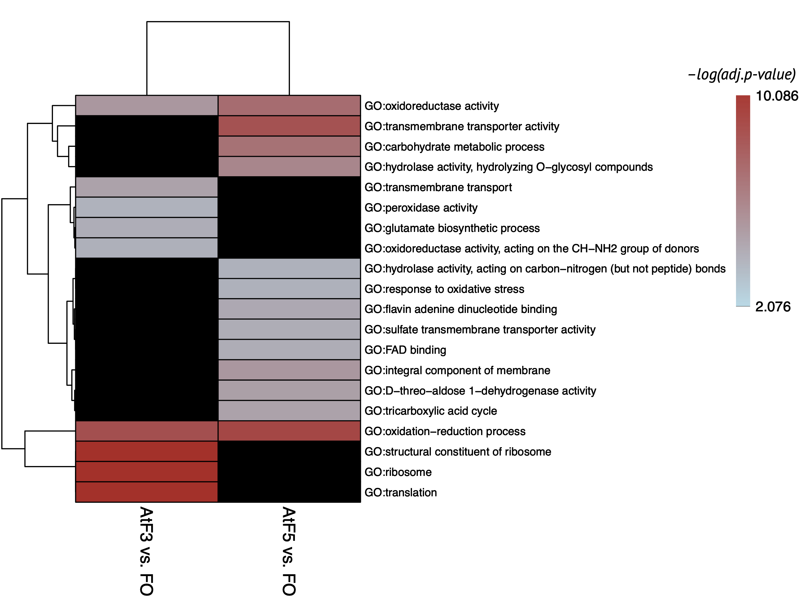
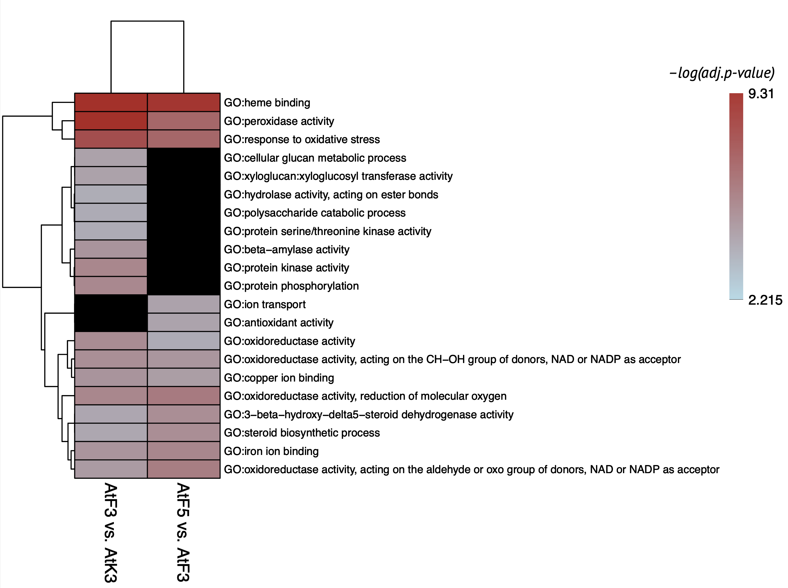
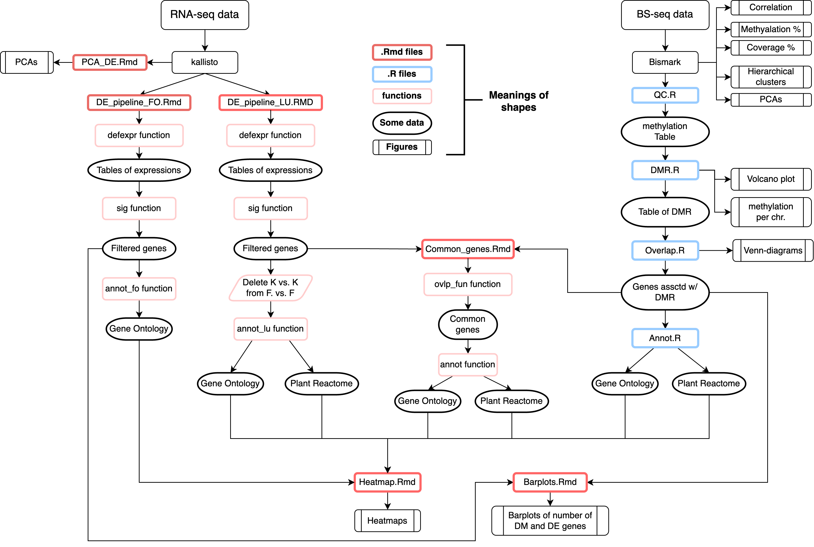

# Host-parasite interaction in Fusarium infection of flax

**NB!** We did not uploaded part of our data, because it will be used in our future work and published later as a part of article.

## Motivation

**Flax** wilt is an aggressive disease caused by soil-borne pathogen ***Fusarium oxysporum f. sp. lini*** **(FOLINI)**. The fungus poses a major threat to flax production worldwide, as occasionally yield **losses reach 70%**. Here, we present first insights into regulatory mechanisms involved in **response** of flax varieties **to the infection**.

## Aim and objectives 
Our ain is to study the regulation of expression of genes responsible for the molecular mechanisms of flax response to FOLINI infestation

**Objectives:**  

* RNA-seq and BS-seq sequencing data processing
	* Alignment of reads to the reference genome
	* Filtering and preprocessing data
* Statistical analysis of contrasts between various conditions of flax and FOLINI
	* Differential gene expression analysis (DE)
	* Determination of differential methylated DNA regions (DMR)
* Annotation enrichment analysis with terms:
	* Gene Ontology 
	* Plant Reactome (for flax)
* Integrative Analysis (DE genes ✕ DM genes → Enrichment)

## Experiment and methods

In this study we examined **susceptible and resistant** flax varieties, namely, **LM98 and Atalante**, **infected** by highly virulent MI39 **FOLINI** isolate. Uninfected plants and pure culture of the fungus served as controls. Flax samples were harvested **on the third and the fifth day post inoculation (dpi)**.
A **total RNA and DNA** mixtures (i.e., flax and fungus) was extracted **from infected plant roots and sequenced**. DNA was converted by **bisulfite** before sequencing.

Reads were were aligned on reference genomes – MI39 isolate for fungus and flax genome assemble with accession number [GCA_000224295.2](https://www.ncbi.nlm.nih.gov/assembly/GCA_000224295.2). 
Aligning reads and abundances quantification of **transcripts** were obtained by processing RNA-seq data with [Kallisto](https://github.com/pachterlab/kallisto).
Aligning of reads and identification of **methylation** positions and context (CpG, CHG, CHH, where H = A/C/T) were obtained by processing BS-seq data with [Bismark](https://github.com/FelixKrueger/Bismark).
**Quality control and filtering** were complete with [sleuth](https://github.com/pachterlab/sleuth) and [methylKit](https://github.com/al2na/methylKit) R packages for transcriptome and methylome data respectively.
Transcripts and methylation regions were **filtered** by number of cytosines and coverage.  

We **planned** to analyze 12 flax and 4 FOILINI comparisons between different experimental conditions in differential expression and differential methylation analyses.

### FOLINI

<table>
<thead>
  <tr>
    <th colspan="4">Difference between</th>
  </tr>
</thead>
<tbody>
  <tr>
    <td>LMF3 vs. FO</td>
    <td>LMF5 vs. FO</td>
    <td>AtF3 vs. FO</td>
    <td>AtF5 vs. FO</td>
  </tr>
</tbody>
</table>

### Flax

<table>
<thead>
  <tr>
    <th colspan="4">Difference between</th>
  </tr>
</thead>
<tbody>
  <tr>
    <th colspan="2">Between infected and control samples</th>
    <th colspan="2">During infection</th>
  </tr>
  <tr>
    <td align="center">LMF3 vs. LMK3</td>
    <td align="center">LMF5 vs. LMK5</td>
    <td align="center" colspan="2">LMF5 vs. LMF3</td>
  </tr>
  <tr>
    <td align="center">AtF3 vs. AtK3</td>
    <td align="center">AtF5 vs. AtK5</td>
    <td align="center" colspan="2">AtF5 vs. AtF3</td>
  </tr>
  <tr>
    <th colspan="2">Between varieties of flax</th>
    <th colspan="2">Between control samples</th>
  </tr>
  <tr>
    <td align="center" colspan="2">AtF3 vs. LMF3</td>
    <td align="center">LMK5 vs. LMK3</td>
    <td align="center">AtK5 vs. AtK3</td>
  </tr>
  <tr>
    <td align="center" colspan="2">AtF5 vs. LMF5</td>
    <td align="center">AtK3 vs. LMK3</td>
    <td align="center">AtK5 vs. LMK5</td>
  </tr>
</tbody>
</table>

**Initial analysis** consisted of checking of principal components, hierarchical clustering and correlation between samples. The determination of **DE genes (DEG)** was performed with the sleuth R package using **adjusted p-value** (Benjamini-Hochberg) and **logarithm of fold change **as thresholds. DMR were obtained by utilizing methylKit R package using **adjusted p-value** (Benjamini-Hochberg) and **methylation percentage difference**.  
***Integrative analysis***: we intersected the coordinates of DMRs and genes and obtained a list of **genes that were presumably regulated by methylation** (common genes). All three lists of genes (DE, DM, common) were **enriched** by Gene Ontology and Plant reactome **terms** using [XGR](https://xgr.r-forge.r-project.org/) R package

## Results
### Differential methylation

There were a lot of genes associated with DMR in infected Atalante on the 3rd dpi and their number **decreased dramatically on the 5th dpi** compared to control. Also, there were few DM genes between controls.
Analysis of LM98 showed low number of DM genes between **all conditions** of the variety. 
Contrasts between LM98 and Atalante varieties showed **large list of methylated genes** in all contrasts, especially between control conditions. However, such big number of DMR discovered in these contrasts is the consequence of **low methyaltion level in LM98 variety**.
**FOLINI had not enough data about methylation to process**

### Enrichment of genes associated with DMR

Enriched GO terms were found **only for 3 comparisons**. Contrasts of LM98 conditions did not enriched due to low number of obtained genes.
**Surprisingly, no terms** were found for comparisons of **control samples** between varieties, although big number of genes associated with DMR were reported for these contrasts.
Main enriched GO terms found AtF5 vs. AtF3 contrast connected with: 

* **Phosphorylation**
* **ATPase/GTPase activity**
* **Response to oxidative stress**
* **Carbohydrate metabolism**

The important terms found AtF3 vs. AtK3 contrast associated with the same functions with addition of terms of **carbohydrates metabolism**.  

Few enriched Plant Reactome terms were found. They denoted the synthesis of some protective agents (e.g. momilactones)

### Differential expression 

**[!] The annotation enrichment analysis could not be performed with the genes from the differential methylation analysis for the LM98 variety conditions because of their small number. As the most important part of our study was integrative analysis, we decided to focus only on Atalante variety to study molecular mechanisms of resistance to fusariosis.**

#### Flax

<table>
<thead>
  <tr>
    <th>Comparison</th>
    <th>Number of DEG</th>
  </tr>
</thead>
<tbody>
  <tr>
    <td>AtF3 vs. AtK3</td>
    <td>3790</td>
  </tr>
  <tr>
    <td>AtF5 vs. AtK5</td>
    <td>0</td>
  </tr>
  <tr>
    <td>AtF5 vs. AtF3</td>
    <td>1617</td>
  </tr>
  <tr>
    <td>AtK5 vs. AtK3</td>
    <td>1147</td>
  </tr>
</tbody>
</table>

#### FOLINI
<table>
<thead>
  <tr>
    <th>Comparison</th>
    <th>Number of DEG</th>
  </tr>
</thead>
<tbody>
  <tr>
    <td>AtF3 vs. FO</td>
    <td>1731</td>
  </tr>
  <tr>
    <td>AtF5 vs. FO</td>
    <td>1612</td>
  </tr>
</tbody>
</table>

*FO - control Fusarium*

**There were a lot of DEG in infected Atalante on the 3rd dpi and their number decreased to zero on the 5th dpi сompared to control.** Also, there were more genes differentially expressed in the comparison of control samples than genes detected in the differential methylation assay. Number of DEG discovered in contrasts of FOLINI was enough for further analysis.

### Enrichment of DEG of flax

Atalante variety had strong specific response to infection on 3rd dpi. The main functional terms connected to defense response that faded down on 5th dpi:

* **Phytohormones synthesis** (brassinosteroids, terpenoids, jasmonic acid, ethylene, etc.)
* **Response to oxidative stress** (specific enzymes activity and ion binding)
* **Cell wall modification**
* **Kinase activity**
* **Endopeptidase inhibitors**
* **Hydrolysis of polysaccharides**

<table>
<thead>
  <tr>
    <th>Important enriched Plant Reactome terms </th>
  </tr>
</thead>
<tbody>
  <tr>
    <td>Ethylene synthesis and signaling</td>
  </tr>
  <tr>
    <td>Momilactone synthesis</td>
  </tr>
  <tr>
    <td>Jasmonic acid biosynthesis</td>
  </tr>
  <tr>
    <td>Methylerythritol phosphate pathway</td>
  </tr>
  <tr>
    <td>Recognition of fungal an pathogens and immunity response</td>
  </tr>
  <tr>
    <td>Response to heaavy metals</td>
  </tr>
</tbody>
</table>

### Enrichment of DE genes of FOLINI

Enriched GO terms on 3rd and 5th dpi for FOLINI are markedly different. 

For the 3rd day of infection discovered annotations were connected with:

* **Synthesis of peptides**
* **Response to oxidative stress**

On the 5th dpi terms were associated with:

* **Transmembrane transport**
* **Carbohydrates metabolism**
* **Response to oxidative stress**

### Integrative analysis

After intersection of DEG and genes associated with DMR we found **no common genes** in AtF5 vs. AtK5 contrast and **one gene** in AtK5 vs. AtK3  

There were enough common genes obtained for AtF3 vs. AtK3 and AtF5 vs. AtF3 for subsequent annotation enrichment analysis. The same terms found for these contrasts were connected with **response to oxidative stress** (specific enzymes activity and ion binding). Also, infected Atalante compared to control on the 3rd dpi differs with terms associated with **polysaccharides metabolism** and **kinases activity**

## Conclusion

1) **Susceptible variety** of flax LM98 had no methylation dynamic during the Fusarium infection and were excluded from analysis  
2) **Resistant variety** of flax Atalante had strong reaction to FOLINI invasion on the 3rd dpi that faded down on the 5th dpi. General enriched terms of DEG revealed several functions involved in the defense response:  

<table>
<thead>
  <tr>
    <td>Phytoharmones synthesis</td>
    <td>Signalling and regulation</td>
  </tr>
</thead>
<tbody>
  <tr>
    <td><b>Response to oxidative stress</b></td>
    <td><b>Associated with hypersensivity reaction</b></td>
  </tr>
  <tr>
    <td>Cell wall modification</td>
    <td>Pathogen spreading prevention</td>
  </tr>
  <tr>
    <td><b>Kinases activity</b></td>
    <td><b>Molecular signaling<b></td>
  </tr>
  <tr>
    <td>Endopeptidase inhibitors</td>
    <td>Supression of FOLINI catabolic enzymes</td>
  </tr>
  <tr>
    <td><b>Hydrolisis of polysacharides</b></td>
    <td><b>Fungus cell wall degradation</b></td>
  </tr>
</tbody>
</table>

3) **Integrative and differential methylation analyses** showed that some molecular mechanisms of defense response partly regulated epigenetically by direct DNA methylation. Such mechanisms **marked as bold text** in the table.  
4) DEG of **FOLINI** turned out to be associated with **peptides synthesis** (possibly some effectors and enzymes) and **response to oxidative stress**. On the 5th dpi DEG were enriched with functional terms of **transmembrane transport**, **carbohydrates metabolism** and **response to oxidative stress**, thus pathogen **continued to actively parasitise**. FOLINI methylation data were insufficient for analysis which is in consistent with recent studies about low methylation dynamic in fungi

## Schematic representation of full pipeline

## Contents

- **DE** - All information about the directory can be seen in it
- **DMR** - All information about the directory can be seen in it
- **Heatmaps** - directory contains .png files of heatmaps of enriched GO and Plant Reactome terms 
- **Barplots** - barplots of number of differentially expressed genes (DEG) and genes associated with differentially methyalted regions of DNA (DMR).
- **Rmarkdown\_scripts** - .Rmd files which used to plot Heatmaps, Barplots and analyze common genes (DEG ∩ genes associated with DMR)  
- **RDS_files** - files that were created during the work of pipeline for fast access to varuiables from different scripts. **This directory is empty** as we cannot publish our full data.